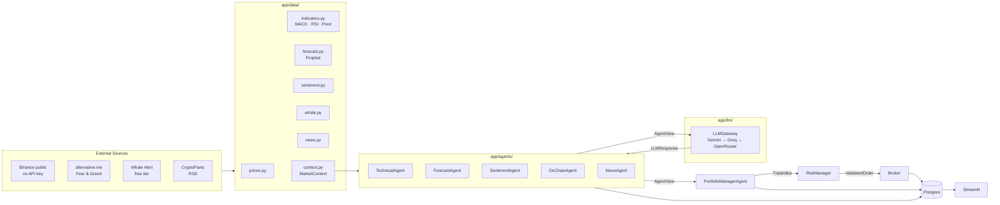
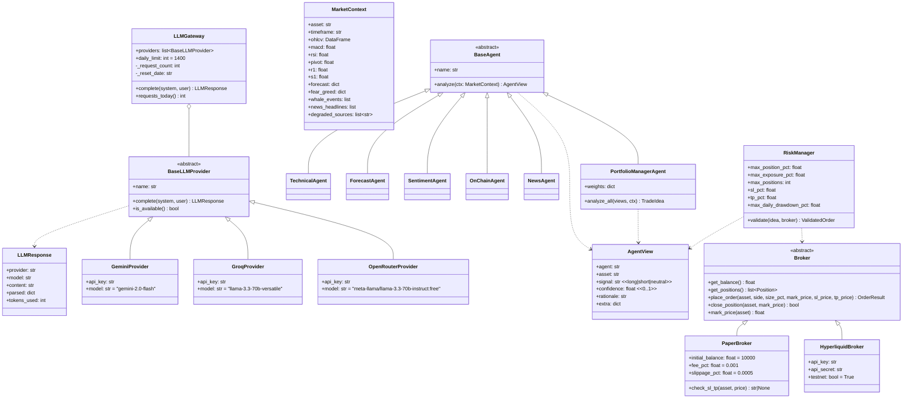
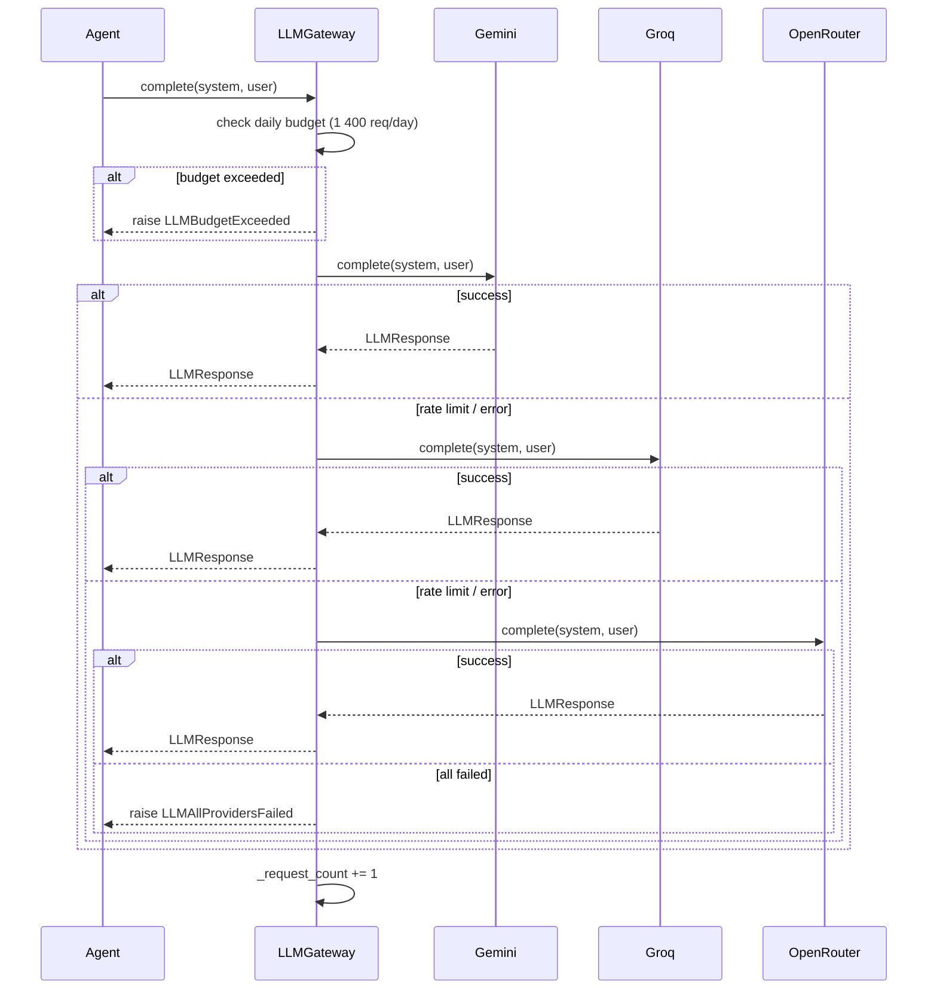

# Architecture — Trading AI Multi-Agent

This document describes the internal design of the system: data contracts, class relationships, the LLM routing strategy, risk rules, persistence schema, and the rationale for choosing a multi-agent approach over a single monolithic agent.

---

## Table of Contents

1. [High-level pipeline](#1-high-level-pipeline)
2. [Class relationships](#2-class-relationships)
3. [Data contracts](#3-data-contracts)
   - [MarketContext](#31-marketcontext)
   - [AgentView](#32-agentview)
   - [TradeIdea](#33-tradeidea)
   - [ValidatedOrder](#34-validatedorder)
4. [LLM Gateway — routing and fallback](#4-llm-gateway--routing-and-fallback)
5. [Free-tier budget analysis](#5-free-tier-budget-analysis)
6. [Broker abstraction](#6-broker-abstraction)
7. [Risk rules](#7-risk-rules)
8. [Database schema](#8-database-schema)
9. [Why multi-agent beats a single agent](#9-why-multi-agent-beats-a-single-agent)

---

## 1. High-level pipeline

One full cycle runs per asset per hour (triggered by GitHub Actions cron `0 * * * *`).



---

## 2. Class relationships



---

## 3. Data contracts

### 3.1 MarketContext

The **blackboard** — assembled once per asset per cycle by `app/data/context.py` and passed to every agent. Agents are pure consumers: they do not call any external API directly.

| Field | Type | Source | Nullable |
|---|---|---|---|
| `asset` | `str` | config | No |
| `timeframe` | `str` | config (`TIMEFRAME`) | No |
| `ohlcv` | `pd.DataFrame` | `prices.py` → ccxt | Yes (degraded) |
| `macd` | `float` | `indicators.py` | Yes |
| `macd_signal` | `float` | `indicators.py` | Yes |
| `macd_hist` | `float` | `indicators.py` | Yes |
| `rsi` | `float` | `indicators.py` | Yes |
| `pivot` | `float` | `indicators.py` | Yes |
| `r1` | `float` | `indicators.py` | Yes |
| `s1` | `float` | `indicators.py` | Yes |
| `forecast` | `dict` | `forecast.py` → Prophet | Yes (degraded flag inside) |
| `fear_greed` | `dict` | `sentiment.py` | Yes (degraded flag inside) |
| `whale_events` | `list[dict]` | `whale.py` | Yes (empty list) |
| `news_headlines` | `list[dict]` | `news.py` | Yes (empty list) |
| `portfolio_state` | `dict` | `Broker.get_positions()` | No |
| `degraded_sources` | `list[str]` | context assembler | No |

When a provider fails, the field is `None` (or an empty list) and its name is appended to `degraded_sources`. The PortfolioManagerAgent discounts `AgentView` objects whose underlying source is degraded.

### 3.2 AgentView

The common output of every specialist agent. Validated by Pydantic v2.

```python
class AgentView(BaseModel):
    agent: str          # e.g. "technical", "forecast", "sentiment"
    asset: str          # e.g. "BTC/USDT"
    signal: str         # "long" | "short" | "neutral"
    confidence: float   # clamped to [0.0, 1.0]
    rationale: str      # human-readable explanation (quoted in the dashboard)
    extra: dict = {}    # agent-specific fields, e.g. {"key_levels": {...}}
```

Signal validation and confidence clamping are enforced by field validators — the LLM cannot produce an out-of-range value that propagates downstream.

### 3.3 TradeIdea

Produced by `PortfolioManagerAgent` after aggregating all specialist views.

| Field | Type | Notes |
|---|---|---|
| `asset` | `str` | |
| `action` | `str` | `open_long` \| `open_short` \| `close` \| `hold` |
| `target_size_pct` | `float` | Fraction of portfolio equity (pre-risk-check) |
| `conviction` | `float` | Weighted average confidence from specialist views |
| `combined_rationale` | `str` | LLM-generated synthesis, citing dissenting views |
| `views` | `list[AgentView]` | Input views that produced this idea |

### 3.4 ValidatedOrder

Output of `RiskManager`. Contains the same fields as `TradeIdea` plus the mandatory risk parameters added or enforced by the risk gates.

| Field | Type | Notes |
|---|---|---|
| `asset` | `str` | |
| `action` | `str` | May be overridden to `hold` by a risk veto |
| `size_pct` | `float` | Capped at `MAX_POSITION_SIZE_PCT` (default 10 %) |
| `sl_price` | `float` | Always set — mandatory |
| `tp_price` | `float` | Always set — mandatory |
| `veto_reason` | `str \| None` | Non-null when the risk manager blocked the trade |

---

## 4. LLM Gateway — routing and fallback



**Key design decisions:**

- The provider list is ordered at construction time (`LLM_PROVIDER_ORDER=gemini,groq,openrouter` in `.env`). The order can be changed without touching code.
- `is_available()` is checked before attempting a call — providers with missing API keys are skipped instantly.
- The daily counter resets at midnight (UTC). It is an in-process counter; for multi-process deployments it should be moved to Redis or the database.
- `LLMBudgetExceeded` is a hard stop — it prevents unexpected costs if the free tier logic ever changes for a paid account.
- All providers request JSON output (Gemini via `responseMimeType`, Groq/OpenRouter via `response_format: json_object`). The `parsed` field of `LLMResponse` always contains a dict (empty `{}` on parse failure).

**Provider details:**

| Provider | Model (default) | Free tier limit | JSON mode |
|---|---|---|---|
| Gemini (AI Studio) | `gemini-2.0-flash` | 1 500 req/day, 15 req/min | `responseMimeType: application/json` |
| Groq | `llama-3.3-70b-versatile` | Varies by model (~14 400 req/day on free) | `response_format: json_object` |
| OpenRouter | `meta-llama/llama-3.3-70b-instruct:free` | Rate-limited per model | Prompt-level |

---

## 5. Free-tier budget analysis

```
Calls per cycle per asset  = 5 specialists + 1 portfolio manager + 1 risk check (optional)
                           = 6–7 calls per asset

Assets                     = 3  (BTC/USDT, ETH/USDT, SOL/USDT)

Calls per cycle            = 7 × 3 = 21 calls/cycle (worst case)

Cycles per day             = 24  (hourly cron)

Calls per day              = 21 × 24 = 504 calls/day
```

| Limit | Value | Headroom |
|---|---|---|
| Gemini free tier | 1 500 req/day | 504 / 1 500 = **34 %** — 3× margin |
| Configured budget guard | 1 400 req/day | Safety buffer of 100 req below free limit |
| Groq free tier | ~14 400 req/day | Never the bottleneck |

**Mitigations available if quota tightens:**

1. Merge the two least-critical specialist agents into one batched call (e.g. OnChain + News).
2. Cache `AgentView` results for assets whose `MarketContext` has not changed materially between cycles.
3. Skip the optional RiskManager LLM check (the deterministic gates already enforce all hard limits).
4. Lower `MAX_OPEN_POSITIONS` to 1 or 2, reducing the number of assets actively analysed.

---

## 6. Broker abstraction

The `Broker` ABC allows the trading logic to be completely decoupled from order execution. Swapping brokers requires only changing `BROKER=` in `.env`.

| Capability | PaperBroker | HyperliquidBroker |
|---|---|---|
| `get_balance()` | Returns virtual balance from in-memory state | Calls Hyperliquid testnet REST API |
| `place_order()` | Simulates fill at `mark_price ± slippage`, deducts fee | Places actual order on testnet |
| `close_position()` | Calculates PnL, updates balance | Closes position on testnet |
| `mark_price()` | Returns last price set via `set_mock_price()` (tests) or live ccxt price | Calls testnet market data endpoint |
| `check_sl_tp()` | Polls current price, auto-closes if SL/TP hit | Hyperliquid handles SL/TP server-side |
| Real money risk | None | None (testnet only) |
| API key required | No | Yes (`HL_PRIVATE_KEY`) |
| Default | **Yes** (`BROKER=paper`) | No (`BROKER=hyperliquid_testnet`) |
| Fee model | Configurable, default 0.10 % | Hyperliquid testnet fees |
| Slippage model | Configurable, default 0.05 % (5 bps) | Market order slippage |

The Hyperliquid testnet requires a small mainnet deposit at the same address to fund the testnet account (a nuance documented in the original series). `PaperBroker` is therefore the zero-barrier default.

---

## 7. Risk rules

The `RiskManager` applies rules in this exact order. **All rules are deterministic Python** — no LLM call can override them.

| # | Rule | Default | Effect on violation |
|---|---|---|---|
| 1 | Kill-switch: daily drawdown | `MAX_DAILY_DRAWDOWN_PCT=5 %` | Veto all new orders for the rest of the day |
| 2 | Max open positions | `MAX_OPEN_POSITIONS=3` | Veto if would exceed limit |
| 3 | No opposing position | — | Veto open if opposite side already open for same asset |
| 4 | Max per-asset exposure | `MAX_POSITION_SIZE_PCT=10 %` | Cap `size_pct` to limit |
| 5 | Max total portfolio exposure | `MAX_TOTAL_EXPOSURE_PCT=30 %` | Reduce `size_pct` proportionally |
| 6 | SL mandatory | `STOP_LOSS_PCT=3 %` | Compute and inject `sl_price` if missing |
| 7 | TP mandatory | `TAKE_PROFIT_PCT=6 %` | Compute and inject `tp_price` if missing |
| 8 | Optional LLM veto check | Off by default | Can only downgrade or veto — never upsize |

Rules 1–7 run unconditionally. Rule 8 is a secondary qualitative filter; even if the LLM recommends a larger position, the size after rule 4/5 is the ceiling.

---

## 8. Database schema

Managed by SQLAlchemy + Alembic. Connection via `DATABASE_URL` (SQLite for local dev, Postgres/Neon for production).

| Table | Purpose | Key columns |
|---|---|---|
| `equity_snapshots` | Equity curve for dashboard | `id`, `ts` (UTC), `balance`, `open_pnl` |
| `trades` | Filled and closed orders | `id`, `asset`, `side`, `entry_price`, `exit_price`, `size`, `pnl`, `fee`, `opened_at`, `closed_at` |
| `decisions` | `TradeIdea` + `ValidatedOrder` per cycle | `id`, `asset`, `action`, `conviction`, `combined_rationale`, `veto_reason`, `ts` |
| `agent_views_log` | Raw `AgentView` from every specialist | `id`, `decision_id` (FK), `agent`, `asset`, `signal`, `confidence`, `rationale`, `extra_json`, `ts` |
| `forecast_errors` | Prophet MAE per asset over time | `id`, `asset`, `timeframe`, `mae`, `ts` — used to weight `ForecastAgent` confidence |

All tables include a `created_at` timestamp column (UTC). The dashboard queries `equity_snapshots` for the equity curve and joins `decisions` → `agent_views_log` for the reasoning panel.

---

## 9. Why multi-agent beats a single agent

The original Simone Rizzo series uses a **single LLM call** that receives all available signals (technical indicators, Prophet forecast, sentiment, whale flows, news) in one prompt and returns a trading decision directly. By Part 4, the author identifies this as the next bottleneck to solve and suggests multi-agent as the evolution. This project implements that suggestion. Here is a concrete comparison.

### Reason 1 — Prompt focus eliminates cross-domain hallucination

A single prompt that mixes RSI values, Prophet confidence intervals, a Fear & Greed number, whale transaction hashes, and news headlines forces the LLM to reason across incompatible domains simultaneously. In practice this produces hedged or contradictory outputs (documented in Part 2 of the series: Gemini, GPT, Claude, and DeepSeek each chose different strategies on the same input).

With specialist agents, each prompt is short and domain-specific. The technical prompt only discusses price levels; the sentiment prompt only discusses Fear & Greed contrarian logic. Shorter, more focused prompts produce more reliable structured outputs.

### Reason 2 — Graceful degradation is per-domain

When CoinGlass (order book data) became unavailable in the series, the entire agent was effectively blind. In the multi-agent design, a broken data source degrades only the corresponding specialist. The `OnChainAgent` may return `signal=neutral, confidence=0.1` with `degraded=True` in its extra data, but the other four agents continue normally. The `PortfolioManagerAgent` discounts degraded views proportionally.

### Reason 3 — The risk gate is structurally separate from the LLM

A single-agent design blurs the boundary between signal generation and risk management — both happen inside the same LLM call. The LLM can therefore be prompted (or hallucinate) into bypassing risk limits.

In this system, the `RiskManager` is pure Python. It runs after every LLM call in the pipeline, it enforces hard numerical limits, and it cannot be overridden by any prompt. The optional secondary LLM veto in the `RiskManager` can only reduce or block a trade, never increase position size.

### Reason 4 — Auditability and explainability

The dashboard can display the exact rationale from every individual specialist alongside the final decision. This means:

- A user can see that the ForecastAgent was uncertain (low MAE confidence on ETH, as documented in Part 4) while the TechnicalAgent and SentimentAgent were both bullish.
- Forecast accuracy per asset is tracked separately in `forecast_errors`, allowing the `PortfolioManagerAgent` weights to be tuned based on empirical evidence.
- Every row in `agent_views_log` is a first-class audit record — the pipeline never makes a decision without a paper trail.

In a single-agent design, the rationale is a single opaque paragraph from one LLM call. There is no way to know which sub-signal drove the decision.
