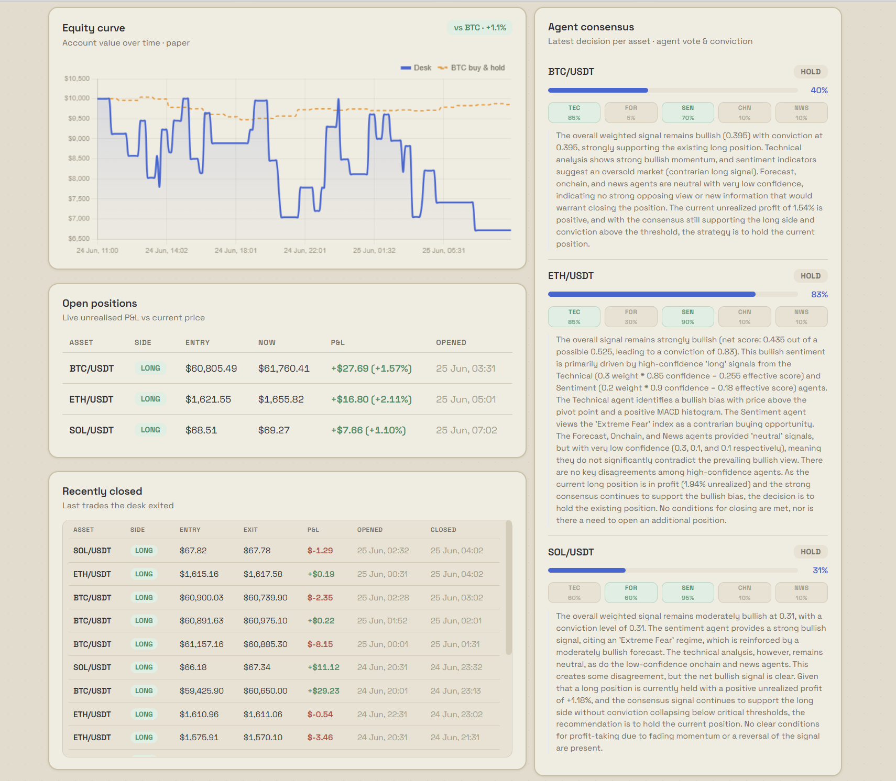
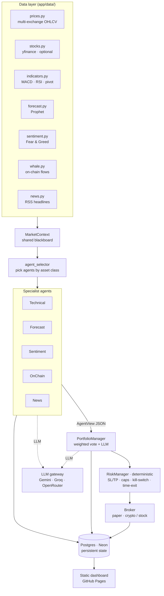

# Trading AI Multi-Agent

[](https://github.com/mazzocco51/trading-ai-multiagent/actions/workflows/ci.yml)


> A small distributed system where **a team of LLM agents** independently analyse the market, vote, and a deterministic risk layer turns that vote into **simulated (paper) trades**. Built as a **computer-science portfolio project** to practise agentic architecture, autonomous-agent orchestration, and zero-cost cloud ops.

**The design goal is capital preservation — defending against crashes, not chasing gains.** Backtested across three market regimes, it lost ~2% in the 2022 bear market while simply holding BTC lost 57% (more in [What the backtest shows](#what-the-backtest-shows-and-what-it-doesnt)).

It runs **fully autonomously in the cloud on a 100% free stack** (free LLM tiers, free Postgres, free CI/CD and hosting) and **never touches real money**.

**🔗 Live dashboard → https://mazzocco51.github.io/trading-ai-multiagent/** — rebuilt and redeployed by the bot itself on every cycle.

[](https://mazzocco51.github.io/trading-ai-multiagent/)

---

## Why I built this (the engineering, not the trading)

The trading domain is just the vehicle. The actual goal was hands-on practice with **agentic software engineering**:

- **Designing a multi-agent system** — five specialist agents behind a uniform `AgentView` contract, coordinated through a shared-context ("blackboard") pattern, with a deterministic coordinator on top.
- **Orchestrating autonomous coding agents** — most of this codebase was built by driving **Claude Code** and **[Pi Agent](https://github.com/badlogic/pi-mono)** (planning tasks, prompting, spawning sub-agents in parallel, reviewing and integrating their work).
- **Zero-cost, production-style ops** — automated tests + CI, a self-updating deployment, persistent state, and resilient external integrations, all on free tiers.

---

## How it works (in one paragraph)

Every cycle, for each asset, a **data layer** assembles a `MarketContext` (prices, indicators, a statistical forecast, market sentiment, on-chain flows, news). Five **specialist agents** each read that context and return a structured opinion (`long`/`short`/`neutral` + confidence + rationale) via an LLM call. A **Portfolio Manager** aggregates the votes (confidence-weighted, **re-normalised over the agents that actually had data**) into a single trade idea. A **Risk Manager** — plain Python, no LLM — validates it against hard limits (stop-loss/take-profit, exposure caps, a daily-drawdown kill-switch, a max-holding-time exit) and either executes it on the paper broker or vetoes it. Everything is persisted to Postgres and rendered to a live dashboard.

> **Why a team of agents instead of one prompt?** Each agent gets a small focused prompt (fewer hallucinations); a broken data source degrades **one** vote instead of the whole decision; and the safety limits live in deterministic code the model can't talk its way around.

---

## What the backtest shows (and what it doesn't)

The desk was backtested across three market regimes (BTC/USDT, deterministic signal mode, with the default features on). The honest takeaway: **it is a defensive, capital-preserving strategy — it protects hard in crashes and keeps risk low the rest of the time.**

| Market regime | Buy & hold | The desk | Outcome |
|---|---|---|---|
| **Bear** — 2022 H1 | **−57%** | **−2%** | **protected capital (+55 pts vs market)** |
| Bull — late 2023→24 | +159% | +4% | roughly flat — stays low-exposure by design |
| Choppy — 2024 | +50% | +4% | small gain, low drawdown |

In the 2022 crash the desk lost ~2% while holding BTC lost 57% — that downside protection (daily kill-switch + trend filter + mandatory stop-loss) is the entire point. It does **not** try to match a raging bull market: it keeps exposure low, so it trades a smaller drawdown for far less upside. Two features improve the risk-adjusted profile and are **on by default**: a **Bull-vs-Bear debate** before each decision (à la TradingAgents) and **regime-adaptive weights** (shift toward sentiment/news in high volatility, technical in calm) — together they lift the Sharpe ratio in every tested window and remove the bull-market bleed.

> Honest caveat: backtests use a deterministic signal mode over a handful of windows on a single pair (BTC), so the two features risk being overfit — illustrative of behaviour, not a performance promise. Both can be turned off in `.env`.

Two experimental, feature-flagged additions (both **off by default**): a bull-vs-bear **debate step** (`DEBATE_ENABLED`) and **volatility-adaptive agent weights** (`ADAPTIVE_WEIGHTS_ENABLED`). A/B backtests over the three regimes show adaptive weights lift the bull window from −10% to +0.2% (+3.6% with both flags) and raise Sharpe in every window, but slightly hurt bear/choppy PnL; the debate proxy alone barely moves the metrics (details in [GUIDA.md](GUIDA.md) and `reports/compare_features_BTCUSDT.md`).

---

## The five specialist agents

Each agent looks at one slice of the input and returns a simple, comparable opinion. None of them sees the whole picture — the Portfolio Manager combines them with configurable weights.

| Agent | Input | Default weight | What it does |
|---|---|---|---|
| **Technical** | MACD, RSI, pivot levels | 0.35 | Reads momentum/structure of the recent price chart |
| **Forecast** | Prophet time-series model | 0.20 | Projects the likely next move and reports its uncertainty |
| **Sentiment** | Fear & Greed Index | 0.20 | Market mood; leans contrarian at extremes |
| **On-chain** | Large wallet transfers | 0.15 | Whether big holders are accumulating or distributing (crypto only) |
| **News** | Recent headlines (RSS) | 0.10 | Flags headline risk (noisy source → deliberately low weight) |

For **stocks**, the crypto-specific agents (on-chain, Fear & Greed) are excluded automatically and the weights are re-normalised.

---

## Architecture



---

## Engineering highlights

- **Uniform agent contract** (`AgentView`) + blackboard `MarketContext` → agents are independent, swappable, and parallelisable.
- **Deterministic risk layer decoupled from the LLM** — safety limits can't be prompt-injected away.
- **Provider-agnostic LLM gateway** with automatic fallback (Gemini → Groq → OpenRouter) and a daily request budget to stay inside free tiers.
- **Resilient data layer** — multi-exchange fallback (survives Binance's geo-block on US CI runners), graceful degradation, and conviction **re-normalised over agents that actually returned data**.
- **Stateful & persistent** — the paper portfolio (balance + open positions) is serialised to Postgres so it survives stateless hourly runs.
- **Automated CI/CD** — `ruff` + `pytest` on every push; the dashboard is rebuilt and **redeployed to GitHub Pages on every trading cycle**.
- **Asset-class abstraction** — crypto by default, US stocks optional (yfinance), with per-class agent selection and market-hours handling.
- **~60 tests**, fully reproducible, zero paid services.

---

## Quickstart

```bash
git clone https://github.com/mazzocco51/trading-ai-multiagent.git
cd trading-ai-multiagent
pip install -e ".[all]"
cp .env.example .env      # add one free Gemini API key (see GUIDA.md)
python -m app.run         # run a single analyse + paper-trade cycle
python -m dashboard.build_html   # regenerate the dashboard (public/index.html)
```

The bot also runs **24/7 in the cloud**: a GitHub Actions workflow (cron + an external trigger for reliability) executes a cycle, persists state to Neon Postgres, and republishes the dashboard to GitHub Pages.

Full setup, free API keys, deployment and the decision math are in **[GUIDA.md](GUIDA.md)**.

---

## Tech stack

Python 3.11 · pydantic / pydantic-settings · ccxt · Prophet · pandas · SQLAlchemy + **Neon** (Postgres) · Chart.js static dashboard (+ optional Streamlit) · **Gemini / Groq / OpenRouter** free tiers · **GitHub Actions** CI/CD + **GitHub Pages** · pytest · ruff.

---

## Disclaimer

Educational / portfolio project. **No real money is ever traded** — the default broker simulates a virtual $10,000 balance. Nothing here is financial advice.

## Credits

Inspired by Simone Rizzo's *"Creo il mio Trading AI Agent"* YouTube series (2025) — which ends by suggesting a multi-agent system as the next step. This repo is that step.
[Part 1](https://youtu.be/tzsRaNytHZ0) · [Part 2](https://youtu.be/_CpICOumgBc) · [Part 3](https://youtu.be/-6jRLa-zjeg) · [Part 4](https://youtu.be/U7V_QSRJfZI)

## License

MIT
