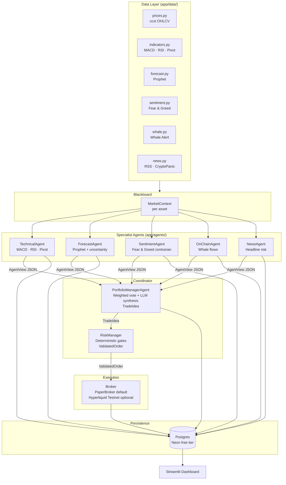

# 🤖 Trading AI Multi-Agent


> A team of AI agents that analyses **BTC, ETH and SOL** every hour, debates the market, and places **simulated** paper trades — built as a computer-science portfolio project, not to make money.

It runs on a **100% free stack** (free LLM tiers, free database, free hosting) and **never touches real money**.

---

## Why I built this

Beyond the trading idea, this project was a hands-on playground for **agentic software engineering** — and that practice is as much the point as the bot itself:

- 🛠️ **Practising with terminal coding agents** — most of this codebase was built by driving **Claude Code** and **[Pi Agent](https://github.com/badlogic/pi-mono)**, learning how to plan, prompt, supervise and debug autonomous coding agents on a real multi-file project.
- 🧠 **Multi-agent programming, in both senses** — *writing* agents (the five specialist trading agents that reason and vote) **and** *orchestrating* them with tools that **spawn sub-agents** to parallelise the work.
- 🆓 **Zero-cost engineering** — delivering a complete, tested, CI-backed system using only free tiers.

The trading bot is the vehicle; the underlying goal was learning how to architect and supervise **systems of autonomous agents**.

---

## What it does

- 🧠 **Five specialist AI agents** look at different things — chart indicators, a price forecast, market mood, whale movements, and news — and each casts a weighted vote.
- ⚖️ A **Portfolio Manager** merges the votes; a **Risk Manager** (plain Python, not AI) enforces stop-loss, take-profit and exposure limits before anything is executed.
- 📝 Every cycle prints a **plain-language explanation** of what the agents thought and why it traded or stayed flat.
- 📊 A **Streamlit dashboard** shows the equity curve, open positions and the full reasoning behind each decision.

> 💡 Why a *team* of agents instead of one? Because each specialist gets a small, focused prompt (fewer mistakes), a broken data source only weakens one agent instead of the whole system, and the safety limits live in deterministic code the AI can't talk its way around.

---

## 📖 Full guide

This README is the quick overview. **For the detailed explanation — how decisions are made, the voting math, setup, deployment and more, written so that even a non-trader can follow — see:**

### → **[GUIDA.md](GUIDA.md)**

---

## Dashboard

<!-- Add your screenshot: save it as docs/dashboard.png and it will appear here -->


Equity curve · open positions · per-agent reasoning · forecast accuracy · win rate.

---

## Architecture



---

## Quickstart

```bash
git clone https://github.com/mazzocco51/trading-ai-multiagent.git
cd trading-ai-multiagent
pip install -e ".[all]"
cp .env.example .env      # then add a free Gemini key (see the guide)
python -m app.run         # run one analysis + paper-trade cycle
```

Launch the dashboard:
```bash
python -m streamlit run dashboard/app.py
```

Full setup, free API keys, 24/7 deployment and backtesting are all covered in **[GUIDA.md](GUIDA.md)**.

---

## Disclaimer

Educational / portfolio project. **No real money is ever traded** — the default broker simulates a virtual $10,000 balance. Nothing here is financial advice.

## Credits

Inspired by Simone Rizzo's *"Creo il mio Trading AI Agent"* YouTube series (2025) — which ends by suggesting a multi-agent system as the next step. This repo is that step.
[Part 1](https://youtu.be/tzsRaNytHZ0) · [Part 2](https://youtu.be/_CpICOumgBc) · [Part 3](https://youtu.be/-6jRLa-zjeg) · [Part 4](https://youtu.be/U7V_QSRJfZI)

## License

MIT
