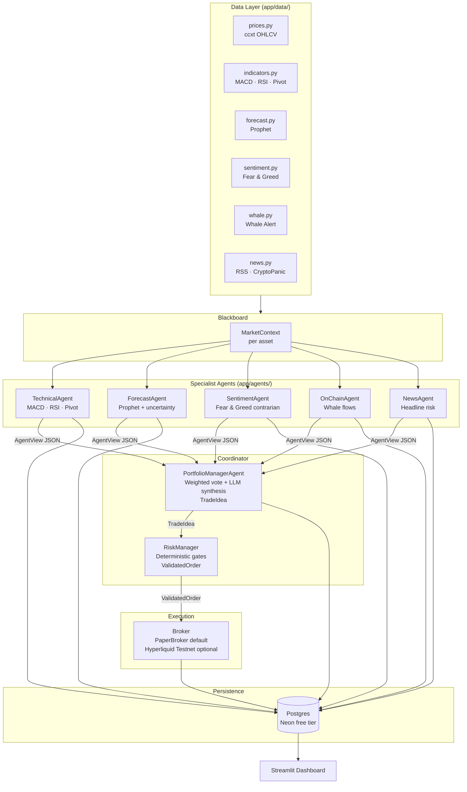

# Trading AI Multi-Agent


> **A multi-agent AI system that analyses BTC, ETH and SOL every hour and executes simulated paper trades — built for a CS portfolio, not for financial profit.**

---

## Motivation

This project is inspired by [Simone Rizzo's four-part YouTube series](https://www.youtube.com/@SimoneRizzo) *"Creo il mio Trading AI Agent"* (Nov 2025), which builds a single LLM-backed trading agent on top of Hyperliquid's perpetual DEX.

The series itself ends with an open question: *"the next step is a multi-agent system."*  
This repository is that next step.

**Why replace a single agent with multiple specialists?**

| Problem with a single agent | Solution in this system |
|---|---|
| One giant prompt must reason over technical indicators, macroeconomic sentiment, on-chain flows, news, and risk simultaneously — hallucinations multiply | Each specialist receives only its own domain data in a focused, short prompt |
| A broken data source silently corrupts the whole decision | A degraded provider marks its agent view `degraded=True`; the coordinator discounts it and continues |
| The LLM is the risk manager — it can be reasoned out of safety limits | Risk gates are deterministic Python, completely separate from any LLM call |
| Adding a new signal requires rewriting the monolithic prompt | Adding a new capability = adding a new agent class |

Additional fix: the original series identified a **timeframe mismatch bug** (Prophet trained on 1 h candles, decisions taken on 15 m data). This project enforces a single `TIMEFRAME` config value used by every component.

---

## Architecture



### Pipeline summary

Each hourly cycle, for each asset (`BTC/USDT`, `ETH/USDT`, `SOL/USDT`):

1. The **data layer** fetches OHLCV candles (ccxt/Binance), computes MACD/RSI/Pivot Points, runs Prophet forecasting, and pulls Fear & Greed, Whale Alert events, and news headlines.
2. All data is assembled into a **`MarketContext`** object — the shared blackboard.
3. Five **specialist agents** each receive the context and return a structured `AgentView` (signal + confidence + rationale) via an LLM call.
4. The **PortfolioManagerAgent** aggregates the five views with configurable weights and a synthesis LLM call, producing a `TradeIdea` (action + conviction + combined rationale).
5. The **RiskManager** applies deterministic gates: mandatory SL/TP, per-asset and portfolio exposure caps, max open positions, and a daily drawdown kill-switch. It may veto or downsize — never upsize — the trade.
6. The **Broker** executes the validated order. `PaperBroker` simulates fills locally with realistic fee (0.1 %) and slippage (0.05 %); `HyperliquidBroker` (optional) hits the Hyperliquid testnet.
7. Every decision, every agent view, and every order is persisted to Postgres for full auditability.
8. The **Streamlit dashboard** reads from the same database and shows the equity curve, open positions, per-agent reasoning, forecast accuracy, and win rate.

---

## Key Features

- **Multi-agent specialisation** — five domain experts + portfolio manager + risk manager, each with a focused system prompt versioned in `prompts/`
- **100 % free stack** — Gemini Flash (AI Studio), Groq Llama, OpenRouter `:free` models; Neon serverless Postgres; GitHub Actions cron; Streamlit Community Cloud
- **LLM gateway with automatic fallback** — Gemini → Groq → OpenRouter, with a daily request budget guard (1 400 req/day by default, well within the 1 500/day Gemini free tier)
- **Graceful degradation** — every data provider returns a `degraded` flag; missing sources reduce an agent's vote weight rather than crashing the pipeline
- **Paper trading by default** — `PaperBroker` simulates a $10 000 virtual portfolio with fee + slippage; no real money is ever touched
- **Deterministic risk gates** — SL/TP mandatory on every position, per-asset 10 % cap, 30 % total exposure cap, 3 max concurrent positions, 5 % daily drawdown kill-switch
- **Full auditability** — every `AgentView`, `TradeIdea`, and `OrderResult` is logged to Postgres; the dashboard exposes the LLM reasoning chain for every trade
- **Consistent timeframe** — a single `TIMEFRAME=1h` setting used by OHLCV fetching, Prophet training, and the trading cron (eliminates the 1 h/15 m mismatch bug documented in the original series)

---

## Quickstart

### 1. Clone and install

```bash
git clone https://github.com/marcomazzocco/trading-ai-multiagent.git
cd trading-ai-multiagent

# Install everything (data, LLM clients, DB, dashboard)
pip install -e ".[all]"
```

### 2. Configure environment

```bash
cp .env.example .env
# Open .env and fill in your free API keys (see "API Keys" section below)
```

### 3. Run

```bash
# Single analysis + paper-trade cycle
python -m app.run

# Continuous hourly loop (local runner)
python -m app.run --loop --interval 3600
```

### 4. Launch the dashboard

```bash
streamlit run dashboard/app.py
```

---

## Free API Keys

All keys are optional at startup — missing providers are skipped with graceful degradation. The system runs in pure paper-trade mode with zero keys (LLM calls will fail without at least one LLM key).

| Service | Where to get it | Cost |
|---|---|---|
| **Gemini Flash** (primary LLM) | [aistudio.google.com](https://aistudio.google.com) → "Get API key" | Free — do **not** enable billing on the project |
| **Groq** (fallback LLM) | [console.groq.com](https://console.groq.com) → API keys | Free tier |
| **OpenRouter** (secondary fallback) | [openrouter.ai](https://openrouter.ai) → keys | Free — use `:free` model suffix |
| **Neon** (Postgres) | [neon.tech](https://neon.tech) → new project → connection string | Free tier, no card |
| **Whale Alert** (optional) | [whale-alert.io](https://whale-alert.io) | Free tier (limited events) |
| **CryptoPanic** (optional) | [cryptopanic.com/developers/api](https://cryptopanic.com/developers/api/) | Free tier |

Paste each key into `.env`. For GitHub Actions deployment, add them as repository **Secrets** (Settings → Secrets and variables → Actions).

---

## Dashboard

Run locally:

```bash
streamlit run dashboard/app.py
```

Deploy to Streamlit Community Cloud (free):

1. Push this repo to GitHub (public).
2. Go to [share.streamlit.io](https://share.streamlit.io) → New app → select `dashboard/app.py`.
3. In the app's **Secrets** panel, add `DATABASE_URL` (read-only Neon connection string).
4. Deploy — the public URL updates automatically on every push to `main`.

The dashboard shows:
- **Equity curve** over time
- **Open positions** with entry price, SL, TP, and unrealised PnL
- **Decision log** with the reasoning from every specialist agent and the portfolio manager
- **Forecast accuracy** per asset (MAE tracked across cycles)
- **Win rate** and trade history

---

## Backtesting

```bash
python -m app.backtest --start 2024-01-01 --end 2024-06-30
```

`app/backtest.py` replays historical OHLCV data through the same orchestrator with LLM responses optionally cached, producing a reproducible report with P&L, win rate, maximum drawdown, and per-asset forecast accuracy.

---

## Project Structure

```
trading-ai-multiagent/
├── app/
│   ├── config.py               # pydantic-settings: all env vars with sensible defaults
│   ├── run.py                  # entrypoint — single cycle or --loop
│   ├── orchestrator.py         # full pipeline: context → agents → manager → risk → broker → DB
│   ├── data/
│   │   ├── prices.py           # ccxt OHLCV (Binance public, no key)
│   │   ├── indicators.py       # MACD, RSI, Pivot Points (pure pandas)
│   │   ├── forecast.py         # Prophet — trains on recent candles, returns MAE
│   │   ├── sentiment.py        # Fear & Greed Index (alternative.me, no key)
│   │   ├── whale.py            # Whale Alert events (free tier)
│   │   ├── news.py             # CryptoPanic RSS headlines
│   │   └── context.py          # assembles MarketContext (the blackboard)
│   ├── llm/
│   │   ├── gateway.py          # provider router: Gemini → Groq → OpenRouter + budget guard
│   │   └── providers/
│   │       ├── base.py         # BaseLLMProvider + LLMResponse (pydantic)
│   │       ├── gemini.py       # Gemini 2.0 Flash via REST
│   │       ├── groq.py         # Groq Llama 3.3 70B via OpenAI-compatible API
│   │       └── openrouter.py   # OpenRouter :free tier models
│   ├── agents/
│   │   ├── base.py             # BaseAgent ABC + AgentView pydantic model
│   │   ├── technical.py        # TechnicalAgent — MACD/RSI/Pivot
│   │   ├── forecast_agent.py   # ForecastAgent — Prophet + uncertainty disclosure
│   │   ├── sentiment_agent.py  # SentimentAgent — Fear & Greed contrarian logic
│   │   ├── onchain.py          # OnChainAgent — whale flow pressure
│   │   ├── news_agent.py       # NewsAgent — headline risk scoring
│   │   ├── portfolio_manager.py# PortfolioManagerAgent — weighted vote + LLM synthesis
│   │   └── risk_manager.py     # RiskManager — deterministic gates, no LLM bypass
│   ├── broker/
│   │   ├── base.py             # Broker ABC — place_order, close_position, get_balance
│   │   ├── paper.py            # PaperBroker — simulated fills with fee + slippage
│   │   └── hyperliquid.py      # HyperliquidBroker — testnet (optional, env flag)
│   └── persistence/
│       ├── models.py           # SQLAlchemy tables: trades, decisions, agent_views, equity
│       └── repo.py             # repository layer (insert/query helpers)
├── dashboard/
│   └── app.py                  # Streamlit — equity curve, positions, reasoning log
├── prompts/                    # versioned system prompts for each agent (.md files)
├── tests/                      # pytest — unit + integration, always uses PaperBroker
├── .github/workflows/
│   ├── ci.yml                  # lint (ruff) + pytest on every push
│   └── trade-loop.yml          # cron: 0 * * * * (every hour, GitHub Actions free tier)
├── .env.example                # template — copy to .env, never commit .env
└── pyproject.toml              # [all] extra installs everything
```

---

## Disclaimer

**This project is for educational and portfolio purposes only.**

- No real money is ever traded. The default broker is `PaperBroker`, which simulates orders against a virtual $10 000 balance.
- Nothing in this repository constitutes financial advice.
- Cryptocurrency markets are highly volatile. Past simulated performance is not indicative of future results.
- The optional Hyperliquid testnet integration uses play money only.

---

## Credits

Inspired by Simone Rizzo's *"Creo il mio Trading AI Agent"* YouTube series (2025):

- [Parte 1 — Da Hyperliquid a Python](https://youtu.be/tzsRaNytHZ0)
- [Parte 2 — Dalla teoria all'Agent](https://youtu.be/_CpICOumgBc)
- [Parte 3 — The Launch](https://youtu.be/-6jRLa-zjeg)
- [Parte 4 — Primi risultati +6% / Multi-Agent](https://youtu.be/U7V_QSRJfZI)

---

## License

[MIT](LICENSE) — Marco Mazzocco, 2025.
